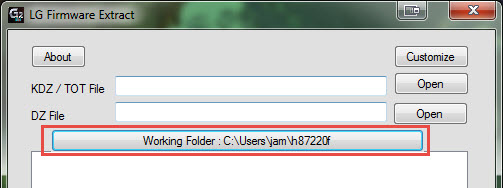
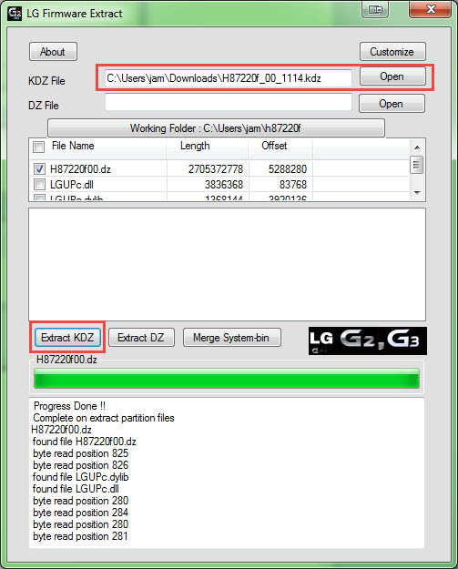
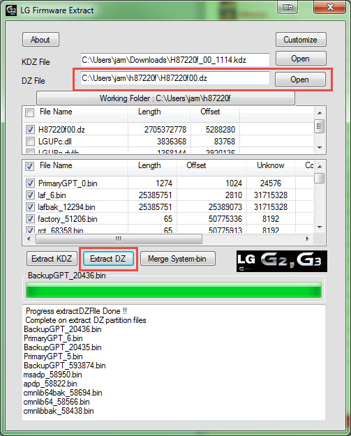
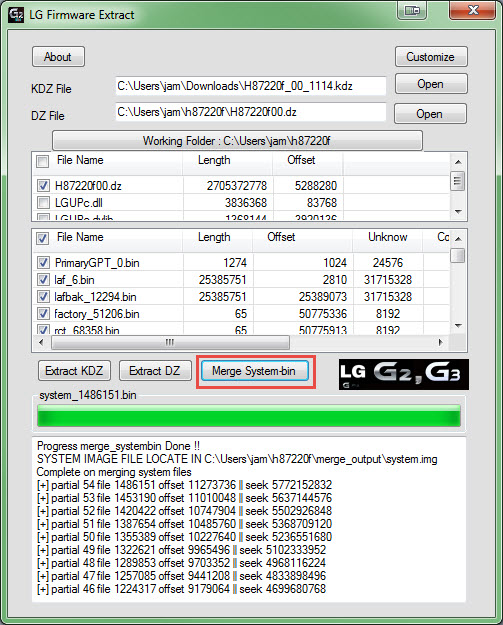
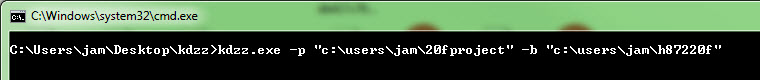
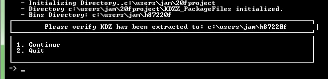
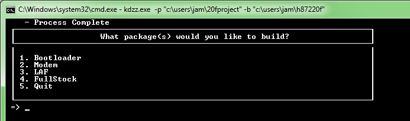
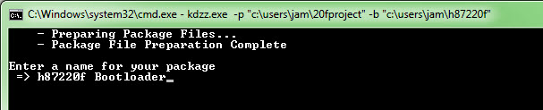
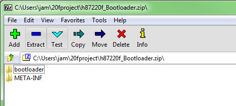
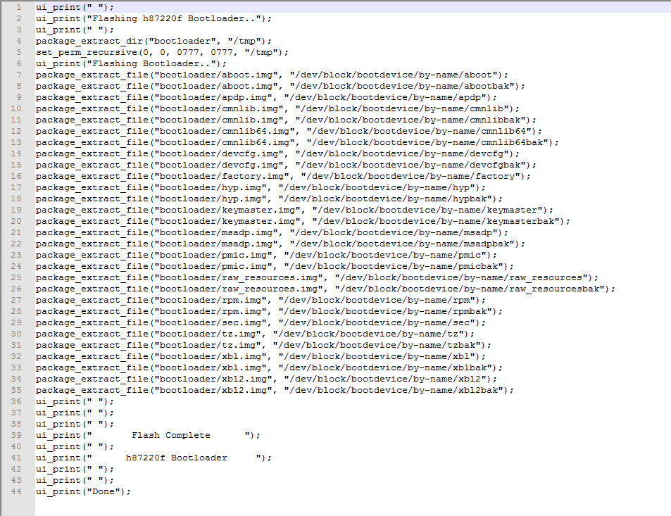

# KDZZ

LG KDZ Zip Package Creation Tool - For TWRP Packages

## Latest Version 

  Download Now: [KDZZ v 1.0.1.0](https://github.com/adanvdo/KDZZ/releases)

*Features will continue to be added/updated over time.*

## Requirements
	
  - H872 or H932 KDZ File
  - Windows LG Firmware Extract tool
    - [Download v1.2.6.1](https://sourceforge.net/projects/lgtools/files/KDZTools/WindowsLGFirmwareExtract_v1.2.6.1.zip/download)
	
## Installation

  - Extract contents of KDZZ.zip to the directory of your choice.

## Usage Instructions
---
#### 1. Extract KDZ

  - Using Windows LG Firmware Extract
    - Set your working directory (i.e. C:\Users\JDOE\Desktop\KDZFiles)

		- 
	- Extract the DZ file from the KDZ
		- 
	- Extract the bins from the extracted DZ file
		- 
	- Merge the extracted System bins
		- 

#### 2. Run KDZZ

  - **Open CMD in Windows**
  - **cd to KDZZ.exe directory or type** 
    - `[path to KDZZ.exe] -p "[destination project directory path]" -b "[path to extracted kdz files]"`
    - `example: C:\Users\JDOE\KDZZ\KDZZ.exe -p "C:\Users\JDOE\20fproject" -b "C:\Users\JDOE\h87220f"`
    - 		  

  - **Press enter to run the utility. Follow the prompts.**

    - 		

  - **KDZZ will copy all of the relevant, extracted KDZ bins to the project directory.  When complete, you will be prompted to choose a package type.**

    - 

  - **Specify your package name**

    - 

  - **Wait for Zip file to be created**

    - 

  - **Example Bootloader Package** 

    - 

    - 
	

## License
---
ISC License (ISC)
